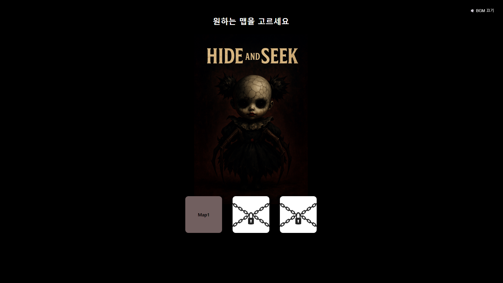
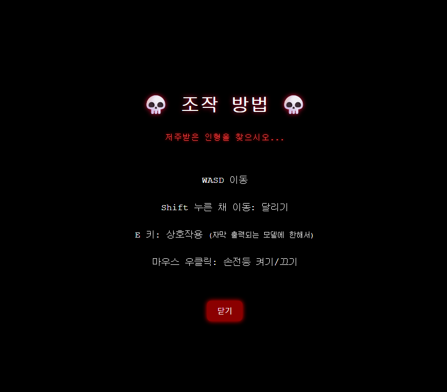
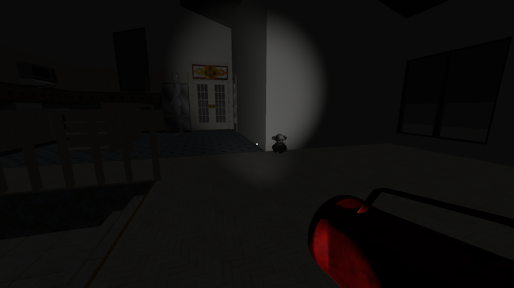

# Hide and Seek

Three.js로 제작한 1인칭 웹 공포 게임입니다. 어두운 저택을 탐색하며 열쇠를 찾고 인형 등의 오브젝트를 조사하면서, 공간 곳곳에서 발생하는 공포 연출을 통과해 탈출하는 것을 목표로 합니다.

> 개인 프로젝트 · Web 3D Game · JavaScript / Three.js

## Demo

- [게임 실행하기](https://max4779.github.io/CG_Horror_game/)
- 현재 **Map 1 / Chapter 1**을 플레이할 수 있습니다.
- 대용량 3D 모델과 오디오로 인해 초기 로딩이 길 수 있으며, 실행 환경에 따라 프레임 저하가 발생할 수 있습니다. 원활한 확인을 위해 로컬 실행을 권장합니다.



## 프로젝트 개요

웹 브라우저에서도 1인칭 공포 게임의 탐색과 긴장감을 구현하는 것을 목표로 제작했습니다. 플레이어는 손전등을 사용해 저택을 조사하고, 오브젝트와 상호작용하며 탈출에 필요한 조건을 순서대로 충족해야 합니다.

| 항목 | 내용 |
| --- | --- |
| 개발 형태 | 개인 프로젝트 |
| 플랫폼 | Desktop Web Browser |
| 장르 | 1인칭 탐색형 공포 게임 |
| 플레이 범위 | Map 1 / Chapter 1 |
| 주요 기술 | JavaScript, Three.js, Vite |

## 주요 구현 기능

- **1인칭 이동과 시점 제어**: Pointer Lock과 카메라 방향 벡터를 이용한 WASD 이동 및 달리기 구현
- **충돌 및 벽면 슬라이딩**: Raycaster로 진행 방향의 충돌을 검사하고 충돌 면의 법선 벡터를 이용해 이동 방향을 보정
- **오브젝트 상호작용**: 플레이어 위치와 상호작용 박스 사이의 거리를 기준으로 문, 열쇠, 인형 등의 대상을 판정
- **게임 진행 상태 관리**: 열쇠 획득, 오브젝트 조사, 문 개방 조건을 상태 값으로 연결해 Chapter 1 진행 흐름 구성
- **공포 이벤트 연출**: 오브젝트 등장, 이동 경로, 조명 변화, 카메라 제어, 사운드를 조합한 이벤트 구현
- **애니메이션과 공간 음향**: `AnimationMixer`와 `PositionalAudio`를 활용해 캐릭터 움직임과 거리 기반 음향 재생
- **손전등과 환경 조명**: 카메라 방향을 따라가는 SpotLight와 점멸 조명으로 어두운 공간의 탐색 경험 구성
- **일시정지 및 클리어 흐름**: 포인터 잠금 해제, 일시정지 화면, 페이드 아웃과 Chapter Clear 화면 구현

## 기술적 구현

### 충돌 시 이동이 완전히 멈추는 문제

단순히 충돌 여부만 검사하면 벽에 비스듬히 접근했을 때 이동이 끊기는 문제가 있었습니다. 이동 벡터에서 충돌 면의 법선 성분을 제거해 슬라이딩 벡터를 계산하고, 벽을 따라 자연스럽게 이동하도록 처리했습니다.

### 여러 상호작용으로 이어지는 진행 순서

열쇠, 인형, 잠긴 문처럼 서로 의존하는 상호작용을 개별 상태 값으로 관리했습니다. 플레이어의 진행 상태에 따라 같은 문에서도 잠김, 해제, 이동 이벤트가 다르게 실행되도록 구성했습니다.

### 시각·청각 연출의 동기화

특정 위치와 상호작용을 기준으로 모델 표시, 애니메이션, 조명, 공간 음향을 함께 전환했습니다. 이를 통해 별도의 게임 엔진 없이 브라우저 환경에서 순차적인 공포 이벤트를 구현했습니다.

## 조작 방법

| 입력 | 기능 |
| --- | --- |
| `W`, `A`, `S`, `D` | 이동 |
| `Shift` | 달리기 |
| 마우스 이동 | 시점 조작 |
| `E` | 오브젝트 상호작용 |
| 마우스 오른쪽 버튼 | 손전등 켜기/끄기 |
| `Esc` | 일시정지 |




## 기술 스택

- JavaScript (ES Modules)
- Three.js
- GLTFLoader
- Vite
- HTML / CSS

## 로컬 실행

### 요구 사항

- Node.js
- npm

### 실행 방법

```bash
git clone https://github.com/max4779/CG_Horror_game.git
cd CG_Horror_game
npm install
npm run dev
```

실행 후 터미널에 표시되는 로컬 주소로 접속합니다.

## 프로젝트 구조

```text
CG_Horror_game/
├─ page/
│  ├─ index.html       # 게임 화면과 클라이언트 로직
│  └─ assets/          # 3D 모델, 텍스처, 이미지, 오디오
├─ screenshot/         # README 이미지
├─ package.json
└─ vite.config.js
```

## 현재 범위와 개선 방향

- Map 1 / Chapter 1만 플레이할 수 있으며 Map 2와 Map 3은 아직 구현되지 않았습니다.
- 대용량 3D 모델과 오디오로 인해 웹 배포 환경에서 초기 로딩 시간이 길 수 있습니다.
- 향후 에셋 최적화, 로딩 진행 표시, 게임 로직 모듈화를 통해 유지보수성과 실행 성능을 개선할 수 있습니다.

## 개발 범위

게임 진행 로직, 입력, 충돌 처리, 상호작용, 이벤트 연출, UI와 웹 실행 환경을 직접 구현했습니다. 3D 모델, 텍스처 및 음원은 외부 제작 리소스를 활용했습니다.
